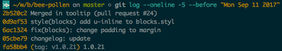
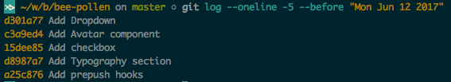

# Commits styleguide

Muitas vezes não se tem um padrão a ser seguido e são feitos de diversas formas o commit criando diferentes padrões e transformando a sua lista de changelog em um verdadeiro campo de guerra, pensando nisso e em simplificar o dia a dia temos alguns  motivadores para a criação deste styleguide, dos quais os pontos são:

* A navegação simplificada pelo histórico de commits
* Manter um padrão único entre os desenvolvedores
* Passar o contexto da mudança para os outros desenvolvedores
* Ajudar na mantenabilidade do projeto em longo prazo

Um log bonito e bem cuidado é uma coisa util não só para os devs, mas para o produto no geral, pois você garante uma revisão de histórico útil e o time deve concordar uma convenção que siga esses três aspectos

**Estilo**: sintaxe, gramática, capitalização, pontuação. Elabore essas coisas, remova o jogo de adivinhação e faça tudo o mais simples possível.

**Conteúdo**: que tipo de informação deveria conter no corpo da mensagem de commit? ou se não deveria conter

**Metadata**: como devemos rastrear as referencias das issues, por IDs, pull request ou o que deve ser utilizado como referencia?

Pois depois de tudo que foi dito acima você gostaria de ver um log assim:



ao invés de algo similar a isto



certo?


### Formato do commit

O formato do commit existem algumas convenções bem estabelecidas e que se bem utilizadas se faz necessário não reinventar a roda, basta seguir algumas delas como:

- Separar assunto do corpo da mensagem com uma linha em branco
- Limitar o assunto a 50 caracteres
- Não terminar um título com ponto
- Utilizar do imperativo para escrever o assunto
- Limitar o corpo da mensagem em 80 caracteres
- Usar o corpo da mensagem para explicar o que e o por que ao invés de como

```
<tipo>(escopo): assunto

<corpo>

<rodapé>
```

### Exemplo da messagem de commit

```
fix(listagem): adiciona serviço da api

Adiciona o get aos serviços da api para garantir que a listagem, seja carregada de forma dinâmica e atualizada pela api

Fixes #2310
```

### Título do commit <tipo>(escopo): assunto


Para a escrita do assunto deve se seguir alguns padrões que estão abaixo:

* A primeira linha não pode ter mais de 70 linhas;
* Separe o título da descrição com uma linha em branco;
* Não se deve terminar um título com ponto;
* Use do imperativo para fazer a escrita do assunto.

**tipos permitidos**

* feat (Uma nova funcionalidade para o usuário)

* fix (Bug fix para o usuário)

* docs (Mudança na documentação)

* style (formatação, falta de ponto e virgula)

* refactor (refatoração de código em produção)

* test (adicionar testes, refatorar testes)


* chore (Atualização de tarefas)

### Descrição do commit <corpo>

A descrição deve conter o `o que` e o `por que` daquela commit escrito de forma sucinta ao invês de conter o `como` foi feito
