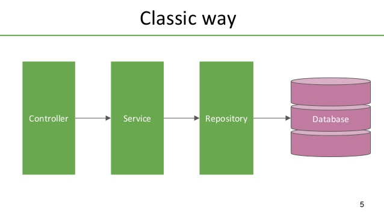

# Patterns

* [Adapter](#adapter)
* [Proxy/Wrapper](#proxy/wrapper)
* [Dependency Injection](#dependency-injection)
* [Padrão de Repository](#padrão-de-repository)
    * [Repositories](#repositories)
    * [Services](#services)
    * [Controllers](#controllers)
    * [Model](#model)
    * [Model Presenter](#model-presenter)
    * [Validações](#validações)
    * [Routers (API)](#routers-api)

## Adapter
 
No contexto de micro serviços e sistemas distribuídos é bastante útil este pattern. O Adapter funciona como uma entidade responsável por fazer o "de-para" de uma estrutura de dados que é inteira ou parcialmente compartilhada entre diferentes sistemas.

Exemplo 

```js
function parseReceiver(receiver) {
  const result = {
    NomeBeneficiario: receiver.name,
    PaisBeneficiario: receiver.country,
    CodPaisBeneficiario: receiver.country_code,
    NomeBancoBeneficiario: receiver.bank_name,
    EnderecoBancoBeneficiario: receiver.bank_address,
    // (...)
  };

  return result;
}

// ...

module.exports = {
  parseCustomer,
  parseCustomerStallos,
  parseTransaction,
  parseTransactionStallos,
  parseCustomerDocument
};
```

## Proxy/Wrapper

Para não sermos refém de uma lib terceira e/ou para estender as funcionalidades da mesma criamos um "embrulho" nessa lib.

Imagine uma lib de log, onde inicialmente precisamos apenas que ela imprima o log na tela em algumas partes do código.
Uma solução simples no node seria usar o `console.log`. Abaixo segue exemplo sem o conceito de **Proxy/Wrapper**

```js

function doSomething() {
  try {
    // doing something
    console.log('Success');
  } catch (err) {
    console.error('Error: ', err);
  }
}

```

```js

function doAnotherthing() {
  try {
    // doing another thing
    console.log('Success');
  } catch (err) {
    console.error('Error: ', err);
  }
}

```

Agora queremos capturar esse log e salvar em um arquivo, podemos utilizar o [winston](https://www.npmjs.com/package/winston)

```js
const winston = require('winston');

const logger = winston.createLogger({
  level: 'info',
  format: winston.format.json(),
  defaultMeta: { service: 'user-service' },
  transports: [
    new winston.transports.File({ filename: 'error.log', level: 'error' }),
    new winston.transports.File({ filename: 'combined.log' })
  ]
});

function doSomething() {
  try {
    // doing something
    logger.silly('Success');
  } catch (err) {
    logger.error('Error: ', err);
  }
}
```

```js
const winston = require('winston');

const logger = winston.createLogger({
  level: 'info',
  format: winston.format.json(),
  defaultMeta: { service: 'user-service' },
  transports: [
    new winston.transports.File({ filename: 'error.log', level: 'error' }),
    new winston.transports.File({ filename: 'combined.log' })
  ]
});

function doAnotherthing() {
  try {
    // doing another thing
    logger.silly('Success');
  } catch (err) {
    logger.error('Error: ', err);
  }
}

```

Note que tivemos que alterar o código das funções. E se quisermos substituir o [winston](https://www.npmjs.com/package/winston) pelo [bunyan](https://www.npmjs.com/package/bunyan)?

```js
const bunyan = require('bunyan');

const logger = bunyan.createLogger({
  name: 'foo',
  streams: [{
    path: '/var/log/foo.log',
  }]
});

function doSomething() {
  try {
    // doing something
    logger.trace('Success');
  } catch (err) {
    logger.error('Error: ', err);
  }
}
```

```js
const bunyan = require('bunyan');

const logger = bunyan.createLogger({
  name: 'foo',
  streams: [{
    path: '/var/log/foo.log',
  }]
});

function doAnotherthing() {
  try {
    // doing another thing
    logger.trace('Success');
  } catch (err) {
    logger.error('Error: ', err);
  }
}
```

Aqui tivemos que substituir o método `silly` para o método `trace`

Como ficaria usando **Proxy/Wrapper**?

Ao criarmos um wrapper é importante ter atenção no contrato desse wrapper e garantir que ele seja expansível, genérico e que contemple o as funcionalidades básicas de seu contexto

A ídeia é criarmos um arquivos que embrule a lib terceira e exponha uma extensão dela (no caso de proxy) ou uma camada de métodos que acessam a lib, assim concentramos todas alterações necessárias em um único ponto

Exemplos:

Primeiro caso:
```js
// ./logger.js
const logger = {
  log: console.log,
  error: console.error,
};

module.exports = logger;
```

```js
const logger = require('./logger.js');

function doSomething() {
  try {
    // doing something
    logger.log('Success');
  } catch (err) {
    logger.error('Error: ', err);
  }
}

```

```js
const logger = require('./logger.js');

function doAnotherthing() {
  try {
    // doing another thing
    logger.log('Success');
  } catch (err) {
    logger.error('Error: ', err);
  }
}

```

Segundo caso:

```js
  // ./logger.js
const winston = require('winston');

const winstonLogger = winston.createLogger({
  level: 'info',
  format: winston.format.json(),
  defaultMeta: { service: 'user-service' },
  transports: [
    new winston.transports.File({ filename: 'error.log', level: 'error' }),
    new winston.transports.File({ filename: 'combined.log' })
  ]
});

const logger = {
  log: winstonLogger.silly,
  error: winstonLogger.error,
};

module.exports = logger;
```

```js
const logger = require('./logger.js');

function doSomething() {
  try {
    // doing something
    logger.log('Success');
  } catch (err) {
    logger.error('Error: ', err);
  }
}
```

```js
const logger = require('./logger.js');

function doAnotherthing() {
  try {
    // doing another thing
    logger.log('Success');
  } catch (err) {
    logger.error('Error: ', err);
  }
}

```

Note que aqui só alteramos o arquivo `./logger.js`

Terceiro caso:

```js
  // ./logger.js
const bunyan = require('bunyan');

const bunyanLogger = bunyan.createLogger({
  name: 'foo',
  streams: [{
    path: '/var/log/foo.log',
  }]
});

const logger = {
  log: bunyanLogger.trace,
  error: bunyanLogger.error,
};

module.exports = logger;
```

```js
const logger = require('./logger.js');

function doSomething() {
  try {
    // doing something
    logger.log('Success');
  } catch (err) {
    logger.error('Error: ', err);
  }
}
```

```js
const logger = require('./logger.js');

function doAnotherthing() {
  try {
    // doing another thing
    logger.log('Success');
  } catch (err) {
    logger.error('Error: ', err);
  }
}

```
Aqui também só alteramos o arquivo `./logger.js`

Usando `Proxy` do javascript, daria para fazer uso das duas libs:


```js
  // ./logger.js
const bunyan = require('bunyan');
const winston = require('winston');

const bunyanLogger = bunyan.createLogger({
  name: 'foo',
  streams: [{
    path: '/var/log/foo.log',
  }]
});

const winstonLogger = winston.createLogger({
  level: 'info',
  format: winston.format.json(),
  defaultMeta: { service: 'user-service' },
  transports: [
    new winston.transports.File({ filename: 'error.log', level: 'error' }),
    new winston.transports.File({ filename: 'combined.log' })
  ]
});

const logger = new Proxy(bunyanLogger,  {
  get: function(target, property) {
    return target[property] || winstonLogger[property] || console[property]
  }
});

module.exports = logger;
```
Outra opção, no caso de classes, é extender a classe

## Dependency Injection 

Visando o baixo nível de acoplamento entre objetos e a inversão de controle, o pattern de injeção de dependência facilita a manutenção, os testes unitários e também a separação de preocupações. Ela funciona, passando uma dependência (uma classe, um método ou qualquer outro objeto) para outra entidade, seja por meio de construtor, interface ou até mesmo métodos (get e set também são utilizados em algumas linguagens). 
Com isso temos mais flexibilidade com a implementação e conseguimos, de maneira mais fácil, criar mocks e stubs para nos auxiliar nos testes por exemplo.

Sem injecção de dependência:

```js
async function saveOnDB({ data }) {
  const db = new MariaDB();

  return db.save(data)
}
```

Aqui se torna quase impossível realizar testes nessa função, ela está fixa com uma instancia do banco MariaDB, ou seja, está quebrando o conceito SRP do [SOLID](../poo/solid/README.md), vamos ver como fica a mesma implementação usando injeção de dependência

```js

async function saveOnDB({ data, db }) {
  return db.save(data)
}
```

Nesse exemplo podemos injetar um objeto db, que nos testes pode ser um mock, a responsabilidade de qual instancia de banco será utilizada não está mais aqui, então o SRP foi seguido

### Benefícios do Dependency Injection 

**Código mais limpo**: Como mostramos no exemplo acima, a função com objetos injetados como parâmetros é mais simples e fácil de ler.

**Código mais testável**: Receber objetos injetados via argumentos nos possibilita criar mocks e stubs de forma mais fácil, melhorando a produtividade e muitas vezes a qualidade do teste.

**Senso do pattern de Iot**: O uso de DI com o tempo cria um senso de como inverter o controle de implementação de objetos. 

**Código reutilizável**: Ao mover as especificações de implementações para um objeto que injetamos, podemos ampliar o alcance e a utilidade do objeto. Ele pode ser usado para várias situações, dependendo do objeto injetado, em vez de usar uma única implementação que pode atender apenas a uma única finalidade. 


---

## Padrão de Repository

Este padrão vem do [DDD](https://www.pluralsight.com/courses/domain-driven-design-fundamentals), também como alternativa ao [DAO](https://en.wikipedia.org/wiki/Data_access_object), para se criar uma abstração sobre a camada de dados.

Junto com os repositories, utilizamos os services (camada de negócio) e os controllers (camada de apresentação/fluxo)

Esse padrão é utilizado da seguinte maneira: Cada camada/domínio/entidade de dados deve possuir um repository exclusivo, ou seja, um serviço não deve ter mais de um repository e um repository não deve ser chamado por mais de um serviço, porém um repository pode acessar mais de uma fonte de dados caso necessário



### Repositories
Os repositories são responsáveis pela camada de dados, eles que sabem onde e como devem buscar/persistir/alterar os dados. Um repository pode ser uma simples abstração da camada de banco de dados, uma abstração de uma request http para uma API externa ou até uma ferramenta de pub/sub por exemplo. Ele não deve expor para quem o consome (services) métodos referentes ao modo de acesso aos dados (repository.post no caso de API ou repository.write no caso de arquivos, o correto é um nome genérico para as ações, nesse caso repository.create seria o ideal), exemplo:

```js
const request = require('request-promise');

class CustomerRepository {
  constructor(params = {}) {
    this.request = params.request || request;
  }

  async create(data) {
    try {
      const result = await this.request.post({ 
        uri: 'https://api.com/v1/customers', 
        body: data 
      });
   } catch (err) {
      console.error(err);
      throw new Error('Ops! something wrong!!!');
   }

    return result.id;
  }
}

module.exports = CustomerRepository;
```

### Services

Os services são responsáveis pela camada de regra de negócio, eles não devem ter conhecimento sobre a camada de apresentação/fluxo (controllers), devem receber os parâmetros necessários através da assinatura dos métodos, para terem flexibilidade a ponto de poderem ser usados em quaisquer situações independente do projeto (API, front end entre outros). Um exemplo de assinatura que deve ser evitada em serviços:

```js
service.create(request);
```

ou:
```js
service.create(htmlForm);
```

O ideal seria:

```js
service.create(customer);
```

ou

```js
service.create({ name, email, phone });
```

Um service deve conter no máximo um repository (camada de dados) pertinente ao seu domínio (um service de produto por exemplo deve conter apenas um repository que acesse os dados de produtos), para acessar dados de outros domínios (quais categorias daquele produto por exemplo) deve se utilizar um outro service, ou seja, um service pode ter N services mas apenas um repository 

### Controllers

Os controllers são responsáveis pela camada de apresentação e pelo fluxo dos dados, no caso de uma API, ele que recebe a requisição e responde a mesma, ele também é responsável por chamar o service (camada de negócio) caso necessário. Controllers não devem conter regras de negócio, apenas lógicas pertinentes a camada de apresentação e fluxo de dados. Exemplo:

```js
controller.updateCustomer = async (req, res) => {
  const customer = { id: req.params.id, ...req.body };
  
  try {
    await service.update(customer.id, customer);
  } catch (error) {
    return res.status(400).end(); // or errorHandler(res, error);
  }

  return res.status(204).end();
}
```

### Model

Model é a representação da camada de dados da aplicação, ele possui além dos campos da entidade, a lógica para validá los, ele é o contrato de endpoint em uma API.

### Model Presenter

O conceito de model presenter é a separação da camada de apresentação com a camada interna da aplicação, ou seja, o Model ao entrar na aplicação ele é tratado por um presenter que o molda de acordo com as regras de cada aplicação. O mesmo vale para a exposição/saída de dados

#### Vantagens:

* **Sanitização**: garantimos que só irá entrar/sair em nosso sistema os dados previamente mapeados
* **Segurança**: uma das aplicação desse conceito é mascarar Ids sequenciais com hashs para quem consome por exemplo
* **Validação**: O dado só entra no sistema se estiver de acordo com as necessidades do mesmo

#### Desvantagens:

* **Demora**: Dependendo da regra do presenter, pode haver uma demora nesse de-para

### Validações

Cada camada possui seu tipo de validação:
* **Presenter**: Valida a estrutura da entrada de dados, campos requeridos, tamanho e tipo de campos, formato dos campos
* **Router**: Valida headers, verbo http, query string, e o que for necessário da camada de http, muitas vezes utilizando de interceptores/middlewares para isso
* **Controller**: Pouca responsabilidade com validações, quando aplicável, valida o fluxo que a requisição deve seguir
* **Service**: Responsável por toda validação referente às regras de negócio
* **Repository**: Valida a estrutura dos dados de acordo com a camada de persistência, em um banco de dados por exemplo, valida os tipos, tamanhos e formato dos campos

### Routers (API)
No caso de APIs, as rotas tem o papel de expor um endpoint (uma URL por exemplo) e fazer a tratativa das chamadas até a chamada do controller, o mesmo controller pode ser utilizado em rotas diferentes, exemplo

```js
function shouldBe(type) {
  return function (req, res, next) {
    if (req.oauthType === type) {
      return next();    
    }

    return res.status(403).end();
  }
}

router.post('v1/bo/customers', 
  shouldBe('operator'), 
  controller.createCustomer);
router.post('v1/customers', 
  shouldBe('customer'), 
  controller.createCustomer);
```
