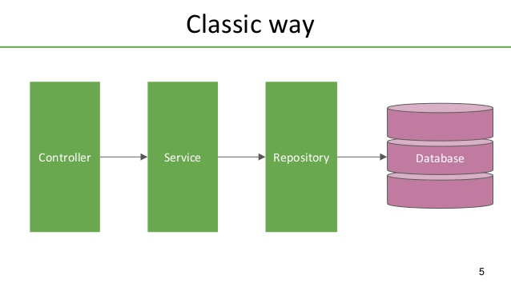

# Padrão de Repository
Este padrão vem do [DDD](https://www.pluralsight.com/courses/domain-driven-design-fundamentals), também como alternativa ao [DAO](https://en.wikipedia.org/wiki/Data_access_object), para se criar uma abstração sobre a camada de dados.

Junto com os repositories, utilizamos os services (camada de negócio) e os controllers (camada de apresentação/fluxo)

Esse padrão é utilizado da seguinte maneira: Cada camada/domínio/entidade de dados deve possuir um repository exclusivo, ou seja, um serviço não deve ter mais de um repository e um repository não deve ser chamado por mais de um serviço, porém um repository pode acessar mais de uma fonte de dados caso necessário



## Repositories
Os repositories são responsáveis pela camada de dados, eles que sabem onde e como devem buscar/persistir/alterar os dados. Um repository pode ser uma simples abstração da camada de banco de dados, uma abstração de uma request http para uma API externa ou até uma ferramenta de pub/sub por exemplo. Ele não deve expor para quem o consome (services) métodos referentes ao modo de acesso aos dados (repository.post no caso de API ou repository.write no caso de arquivos, o correto é um nome genérico para as ações, nesse caso repository.create seria o ideal), exemplo:

```js
const request = require('request-promise');

class CustomerRepository {
  constructor(params = {}) {
    this.request = params.request || request;
  }

  async create(data) {
    try {
      const result = await this.request.post({ 
        uri: 'https://api.com/v1/customers', 
        body: data 
      });
   } catch (err) {
      console.error(err);
      throw new Error('Ops! something wrong!!!');
   }

    return result.id;
  }
}

module.exports = CustomerRepository;
```

## Services

Os services são responsáveis pela camada de regra de negócio, eles não devem ter conhecimento sobre a camada de apresentação/fluxo (controllers), devem receber os parâmetros necessários através da assinatura dos métodos, para terem flexibilidade a ponto de poderem ser usados em quaisquer situações independente do projeto (API, front end entre outros). Um exemplo de assinatura que deve ser evitada em serviços:

```js
service.create(request);
```

ou:
```js
service.create(htmlForm);
```

O ideal seria:

```js
service.create(customer);
```

ou

```js
service.create({ name, email, phone });
```

Um service deve conter no máximo um repository (camada de dados) pertinente ao seu domínio (um service de produto por exemplo deve conter apenas um repository que acesse os dados de produtos), para acessar dados de outros domínios (quais categorias daquele produto por exemplo) deve se utilizar um outro service, ou seja, um service pode ter N services mas apenas um repository 

## Controllers

Os controllers são responsáveis pela camada de apresentação e pelo fluxo dos dados, no caso de uma API, ele que recebe a requisição e responde a mesma, ele também é responsável por chamar o service (camada de negócio) caso necessário. Controllers não devem conter regras de negócio, apenas lógicas pertinentes a camada de apresentação e fluxo de dados. Exemplo:

```js
controller.updateCustomer = async (req, res) => {
  const customer = { id: req.params.id, ...req.body };
  
  try {
    await service.update(customer.id, customer);
  } catch (error) {
    return res.status(400).end(); // or errorHandler(res, error);
  }

  return res.status(204).end();
}
```

## Model

Model é a representação da camada de dados da aplicação, ele possui além dos campos da entidade, a lógica para validá los, ele é o contrato de endpoint em uma API.

## Model Presenter

O conceito de model presenter é a separação da camada de apresentação com a camada interna da aplicação, ou seja, o Model ao entrar na aplicação ele é tratado por um presenter que o molda de acordo com as regras de cada aplicação. O mesmo vale para a exposição/saída de dados

### Vantagens:

* **Sanitização**: garantimos que só irá entrar/sair em nosso sistema os dados previamente mapeados
* **Segurança**: uma das aplicação desse conceito é mascarar Ids sequenciais com hashs para quem consome por exemplo
* **Validação**: O dado só entra no sistema se estiver de acordo com as necessidades do mesmo

### Desvantagens:

* **Demora**: Dependendo da regra do presenter, pode haver uma demora nesse de-para

## Validações

Cada camada possui seu tipo de validação:
* **Presenter**: Valida a estrutura da entrada de dados, campos requeridos, tamanho e tipo de campos, formato dos campos
* **Router**: Valida headers, verbo http, query string, e o que for necessário da camada de http, muitas vezes utilizando de interceptores/middlewares para isso
* **Controller**: Pouca responsabilidade com validações, quando aplicável, valida o fluxo que a requisição deve seguir
* **Service**: Responsável por toda validação referente às regras de negócio
* **Repository**: Valida a estrutura dos dados de acordo com a camada de persistência, em um banco de dados por exemplo, valida os tipos, tamanhos e formato dos campos

## Routers (API)
No caso de APIs, as rotas tem o papel de expor um endpoint (uma URL por exemplo) e fazer a tratativa das chamadas até a chamada do controller, o mesmo controller pode ser utilizado em rotas diferentes, exemplo

```js
function shouldBe(type) {
  return function (req, res, next) {
    if (req.oauthType === type) {
      return next();    
    }

    return res.status(403).end();
  }
}

router.post('v1/bo/customers', 
  shouldBe('operator'), 
  controller.createCustomer);
router.post('v1/customers', 
  shouldBe('customer'), 
  controller.createCustomer);
```
