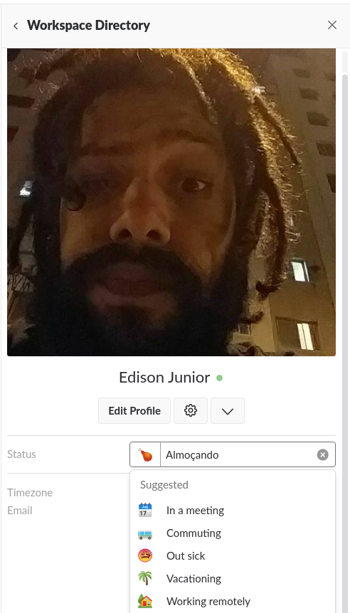
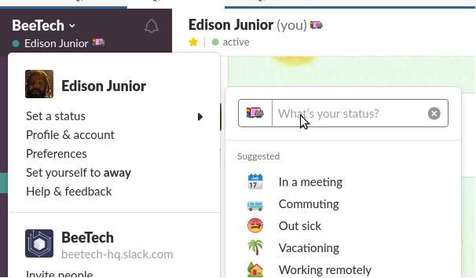

# Apresentação

O trabalho remoto já é um fato no mercado e está mudando radicalmente a forma como produzimos e nos relacionamos com o espaço de trabalho. Grandes empresas de tecnologia, como a Automatic, Trello, Stack Overflow, Evernote, Atlassian e outras já adotam esse modelo de trabalho que tem se mostrado bastante eficaz e produtivo.

Mesmo com o trabalho remoto já implementado e demonstrando resultados positivos em distintas realidades e mercados, algumas empresas e trabalhadores ainda têm preconceito com essa modalidade de trabalho. 

Este documento pretende apresentar alguns desafios e propostas de solução para a implementação do trabalho remoto em nossa realidade. 

Ao final, deixaremos alguns artigos e dados de referência que podem ajudar no aprofundamento/aperfeiçoamento da discussão e do próprio documento.

# Por que o trabalho remoto?

Alguns pontos sobre a realidade da cidade de São Paulo e os benefícios do trabalho remoto:

* A média de tempo gasto no trânsito em São Paulo é de uma hora e trinta minutos para homens e uma hora e dezessete minutos para mulheres (NOTE:  "Tempo no transporte afeta saúde dos paulistanos, aponta estudo da ...." 28 set. 2017, https://g1.globo.com/sao-paulo/noticia/tempo-no-transporte-afeta-saude-dos-paulistanos-aponta-estudo-da-usp.ghtml. Acessado em 5 abr. 2018.). 

* O tempo gasto no transporte afeta direta e indiretamente a saúde dos paulistanos (NOTE:  "Tempo no transporte afeta saúde dos paulistanos, aponta estudo da ...." 28 set. 2017, https://g1.globo.com/sao-paulo/noticia/tempo-no-transporte-afeta-saude-dos-paulistanos-aponta-estudo-da-usp.ghtml. Acessado em 5 abr. 2018.).

* Uma empresa não pode se privar de ter em sua equipe bons profissionais só por que eles moram longe do escritório físico da empresa.

* Diversas empresas têm compartilhado experiências positivas acerca da produtividade dos trabalhadores remotos. (NOTE:  "Como aderir ao trabalho remoto: O guia completo - Trello." http://info.trello.com/trabalho-remoto-guia. Acessado em 9 abr. 2018.)

* Greves no transporte público, manifestações e trânsito não são impeditivos para se trabalhar quando temos uma política de trabalho remoto.

* O número de interrupções em um ambiente remoto é muito menor do que em uma empresa, onde telefones tocam, pessoas conversam e etc.

* Como - teoricamente - o trabalho remoto não possui um horário pré-definido, a empresa e o profissional podem acertar o melhor horário para manterem uma comunicação, deixando a cargo do profissional, trabalhar no horário em que se sente mais produtivo.

# Fluxo de trabalho

Para a implementação do trabalho remoto alguns pontos devem ser tratados com maior disciplina e cuidado. Elencamos os que encaramos como principais abaixo:

* Comunicação - A comunicação é a parte mais importante do trabalho em equipe, seja ele presencial ou remoto. No trabalho remoto ela é ainda mais importante, já que não estamos compartilhando o mesmo espaço físico e, logo, a única forma de comunicação que temos com o time é por meio das ferramentas disponibilizadas pela empresa. No trabalho remoto nos comunicamos de duas formas:

    * Comunicação assíncrona - Um tipo de comunicação que não exige resposta imediata. Pode ser feita em ferramentas de chat com o time todo ou com uma pessoa.

    * Comunicação síncrona - A que exige interação e resposta imediata. O ideal é que seja feita por áudio e/ou vídeo.

O ideal é que a comunicação seja centralizada em ferramentas corporativas disponibilizadas pela empresa. Isso evita a dispersão de informação e confusões do tipo "Qual é o canal da semanal?" além de nos ajuda a manter um histórico consolidado do que foi já foi discutido nas conversas anteriores. Resumindo: Whatsapp é bom pra mandar memes e marcar brejas. Papo de trampo é no Slack!

* Report de status - é importante que a equipe saiba qual a sua disponibilidade no momento. É possível reportar o seu status editando o seu perfil no slack como mostra a imagem abaixo:

Existem outras formas bem legais e automatizadas para se utilizar o slack, abordaremos elas no ponto de Ferramentas.

* Acompanhamento e revisão de pull requests - Em diversas empresas esse é um ponto de atenção a ser mitigado. Por vezes o dev fica focado em seu próprio código e deixa em segundo plano a revisão do código do colega, isso atrasa as entregas e deixa o time enfraquecido. Uma boa dica é reservar momentos do dia para isso, você pode criar reminders no Slack, lembretes no Google Calendar ou usar qualquer outra ferramenta que lembre de olhar os PRs do time.

* Cerimônias em dias e horários fixos - Uma outra *dor *de quem trabalha remoto são as cerimônias e reuniões em horários decididos na hora por quem está no escritório. Essa flexibilidade de horários pode ser confortável pra quem está no espaço físico da empresa, mas para quem trabalha remoto isso é um tormento. O trabalhador remoto para a tarefa que está fazendo para participar da daily/semanal/retrospectiva/planning, se loga na videochamada e por vezes fica um bom tempo sozinho até ser informado que o evento acontecerá em outro horário. Isso prejudica a produtividade e concentração de quem trabalha remoto.

* Stream all - Trabalhadores remotos não devem ser excluídos dos eventos da empresa. Papo de Brother, Save the dates e outros eventos corporativos devem envolver quem não está no espaço físico do escritório. Existem ferramentas baratas e até sem custos que proporcionam isso. (ver mais no tópico de ferramentas.

* Share All - Em um ambiente misto, compartilhar tudo o que acontece no espaço físico da empresa é imprescindível para que o profissional remoto se sinta "em casa". Modificações de fluxo, decisões sobre projetos e até aquela PoC tão sonhada, que por hora são feitos nas famosas "conversas de corredor" devem ser enviadas para a ferramenta de comunicação da empresa, para que todos possam ficar por dentro, principalmente os membros remotos.

# Ferramentas Recomendadas

Segue aqui uma lista de algumas ferramentas úteis para o trabalho remoto e até mesmo para o presencial:

* Comunicação Assíncrona:

    * Slack (sério, usemos o whatsapp, telegram, skype, google talk, msn, icq e irq somente para conversas pessoais e memes).

* Comunicação Síncrona:

    * [Google Hangouts](https://hangouts.google.com/) - ferramenta já contratada pela empresa.

    * [Appear.in ](https://appear.in/)- ferramenta útil para vídeochamadas rápidas.

    * Telefone (em caso de urgência o bom e velho telefonema dos brothers entra em ação).

* Pair Programing

    * [Vim + Tmux + SSH](https://www.hamvocke.com/blog/remote-pair-programming-with-tmux/) - pra quem curte um terminalzinho malandro. (dica do @victor)

    * VScode

        * [Live Share](https://code.visualstudio.com/blogs/2017/11/15/live-share) - Ferramenta nativa do VScode

        * [Sockscode](https://marketplace.visualstudio.com/items?itemName=shyykoserhiy.sockscode-vscode) - Plugin de código aberto para pair programing. Você pode criar uma room no server público da ferramenta (o que é inseguro, mas pode ser útil em projetos pessoais e/ou de código aberto) ou ainda criar um [servidor privado](https://github.com/sockscode/sockscode-server).

    * Sublime Text

        * [RemoteCollab](https://packagecontrol.io/packages/RemoteCollab) - Plugin de código aberto e simples utilização.

* Autogestão

    * [Todoist](https://ptbr.todoist.com/) - Gerenciador de tarefas online. A versão free permite sincronização online com todos os seus dispositivos.

    * [Tomatobot](https://tomatobot.matthewhiggins.me/) - Um bot de tomato pro slack!

    * [Strict Workflow](https://chrome.google.com/webstore/detail/strict-workflow/cgmnfnmlficgeijcalkgnnkigkefkbhd?hl=pt-BR) - Um tomato onde você pode configurar bloqueio de sites durante o tempo de concentração.

# Algumas dicas de organização pessoal

* Tenha horários pré-definidos para o trabalho, almoço e descanso - Por vezes o trabalhador remoto se perde no tempo e acaba permanecendo mais tempo do que o necessário "no expediente".
* Tenha um local de trabalho; trabalhar na cama, na sala em frente a TV, tudo isso parece muito legal e confortável, mas na prática se mostra muito ruim, principalmente para sua postura e foco. Ter um local fixo de trabalho (um home office, um café e etc) é sempre bom para criar uma rotina e melhora em muito sua concentração.
* Atenção as ferramentas: sim, é m-u-i-t-o importante você prestar atenção nas ferramentas de comunicação (como o Slack e E-mails) pois lá estão informações importantes que podem te auxiliar na tarefa.
* Avise a todos que você está trabalhando no horário definido e que tentem não te interromper, isso é realmente muito importante, principalmente amigos e familiares que entram em seu ambiente sem bater e etc.